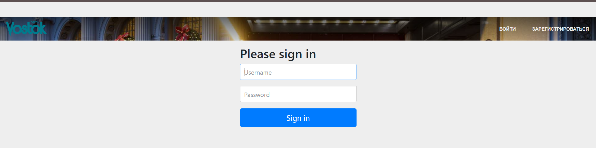

This system uses Spring Security for registration and authorization. Reservations are also available for unregistered users. Unregistered users will be added to the database, but will not be listed as a user and will not be able to view their order history.
## Main page
Here is a description of the hotel and a display of room types
 

</img>
## Authorization/registration
Authorization
 

Registration
 

## Admin menu
List of all users
 

List of all room types
 

List of reservations
 

Profile page
 

## Successful booking page
 

## User page

